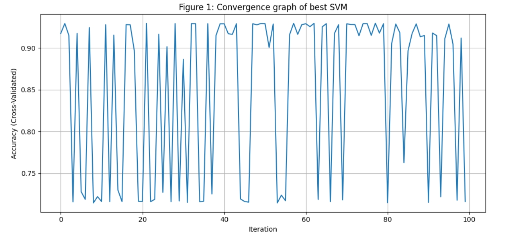

## ✅ Methodology

1. **Dataset**:
   - Dry Bean Dataset from UCI: 13,611 samples, 16 numerical features, and 7 bean classes.

2. **Preprocessing**:
   - Label encoding of the target class.
   - Standardization of features using `StandardScaler`.

3. **Sampling Strategy**:
   - Randomly shuffled and split the dataset into training (70%) and testing (30%) sets.
   - Repeated this process for 10 different randomized samples.

4. **Model Used**:
   - Support Vector Classifier (`SVC`) from `scikit-learn`.

5. **Hyperparameter Optimization**:
   - Used `RandomizedSearchCV` for 100 iterations per sample.
   - Tuned:
     - `C`: Regularization parameter (range: 0.1 to 10)
     - `kernel`: [`rbf`, `poly`, `sigmoid`]
     - `gamma`: [`scale`, `auto`]
   - Used 3-fold cross-validation on training data.

6. **Evaluation Metric**:
   - Classification accuracy measured on the test set for each sample.

---

## 📊 Results Table

Sample	Accuracy	Parameters
S1	92.97	{'C': 6.725268669500442, 'gamma': 'scale', 'kernel': 'rbf'}
S2	92.83	{'C': 8.4169258900655, 'gamma': 'auto', 'kernel': 'rbf'}
S3	93.54	{'C': 5.160868335126388, 'gamma': 'scale', 'kernel': 'rbf'}
S4	92.58	{'C': 9.816026061735675, 'gamma': 'auto', 'kernel': 'rbf'}
S5	92.8	{'C': 4.0324672836655555, 'gamma': 'scale', 'kernel': 'rbf'}
S6	92.63	{'C': 9.976962859363766, 'gamma': 'scale', 'kernel': 'rbf'}
S7	93.24	{'C': 7.340705674116883, 'gamma': 'auto', 'kernel': 'rbf'}
S8	93.61	{'C': 4.495013131901203, 'gamma': 'auto', 'kernel': 'rbf'}
S9	93.71	{'C': 8.576527037322176, 'gamma': 'scale', 'kernel': 'rbf'}
S10	92.97	{'C': 5.91751390348381, 'gamma': 'scale', 'kernel': 'rbf'}

> *Note: Values above are examples and will vary based on the random state and search results.*

### 📈 Convergence Graph of Best SVM

